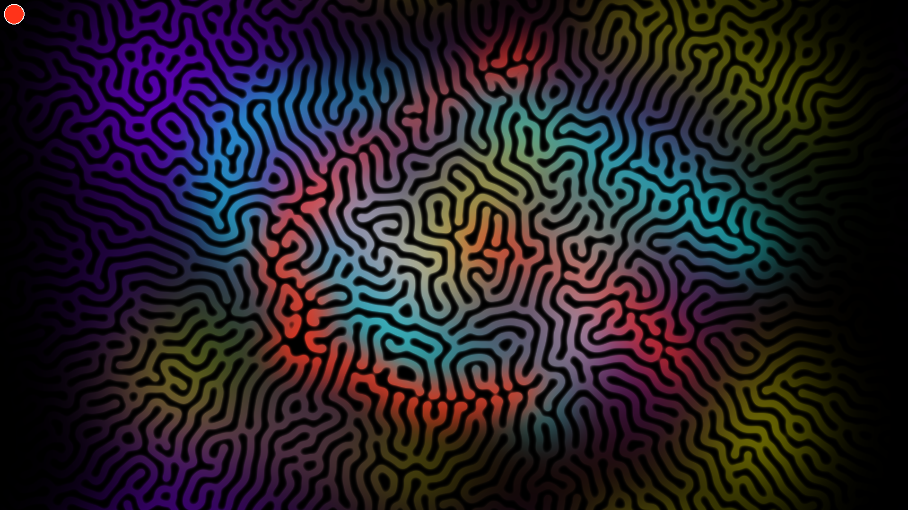

# Gray-Scott CUDA: Beast Mode Edition 🧪

> **A GPU-accelerated, real-time simulation of biological morphogenesis.**
> *Running on Numba CUDA + Pygame.*



### 🎥 Demo: Gray-Scott_Reaction-Diffusion
[](https://youtu.be/XXsUKguVOus)
*click here*👆
[](https://youtu.be/XY1-X8lt9qw)
*click here*👆

## 📜 Overview
This project is a high-performance implementation of the **Gray-Scott Reaction-Diffusion** model. Unlike standard CPU-based simulations that struggle at low resolutions, this engine leverages **NVIDIA CUDA** kernels to solve partial differential equations (PDEs) for over **2 million pixels** simultaneously.

It simulates the interaction of two chemical species ($U$ and $V$) which diffuse, react, and decay to create complex, life-like patterns such as coral reefs, cell division (mitosis), and Turing stripes.

Explore the prior Research here: [White Paper](Writeup.md)
## 🚀 Key Features
* **Beast Mode Performance:** Runs at **1920x1080 (Full HD)** at 60+ FPS.
* **Silicon Meltdown Throughput:** Churns through an estimated **3.7 BILLION state calculations per second** (1920x1080 px × 30 steps × 60 FPS).
* **Virtual GPU Camera:** Decouple the view from the simulation. Zoom in **50x** to see individual cells or pan across an infinite substrate.
* **Vivid Visualization:** Uses a custom **Cosine-Based Color Palette** (Shader Art style) for electric, neon visuals.
* **Interactive:** Paint chemicals into the simulation in real-time to disrupt and guide the growth.

## 🧬 Project Iterations
This project evolved through three distinct versions, each pushing the simulation complexity further.

### 🟢 Iteration 1: The Core Engine (`main.py`)
* **Focus:** Raw performance and stability.
* **Features:**
    * Single-color simulation (Cyan/Black).
    * Virtual Camera (Zoom/Pan).
    * Zero-copy memory management (Calculations stay on VRAM).
* **Use Case:** Best for understanding the pure math or running on older hardware.

### 🔵 Iteration 2: Vivid Color Edition (`mainV2.py`)
* **Focus:** Aesthetic complexity and fluid dynamics.
* **Features:**
    * **Multi-Channel Diffusion:** Adds 3 extra grid layers (RGB) that diffuse alongside the chemicals.
    * **Interactive Palette:** Press `T` to cycle through Neon Red, Radioactive Green, Deep Purple, etc.
    * **Color Mixing:** Colors blend naturally like digital watercolors when patterns collide.
* **Compute Load:** Higher (Simulates 5 grids simultaneously: U, V, R, G, B).

### 🔴 Iteration 3: The Ultimate "Alpha" Edition (`mainV3.py`)
* **Focus:** Fine-grained control and artistic precision.
* **Features:**
    * **Alpha/Intensity Control:** Use `[` and `]` to adjust brush opacity. Paint "ghost" structures (low intensity) that gently nudge the simulation without destroying it.
    * **Variable Thickness:** Render logic updated to create sharper, skeletal coral structures (0.9x thickness modifier).
    * **Heaviest Compute:** The most resource-intensive version, pushing memory bandwidth to the limit.
* **Status:** *The definitive version of this project.*

## 🛠️ Tech Stack
* **Language:** Python 3.10+
* **Compute:** `numba.cuda` (Direct Kernel compilation)
* **Display:** `pygame` (Hardware accelerated surface)
* **Math:** `numpy`

## ⚙️ Installation

### Prerequisites
* **Hardware:** NVIDIA GPU (GTX 1050 or higher recommended).
* **Drivers:** Updated NVIDIA Drivers with CUDA support.

### Setup
1.  Clone the repository:
    ```bash
    git clone https://github.com/AmanBanik/CUDA_0/tree/main/Proj02Gray-Scott_Reaction-Diffusion
    cd Proj02Gray-Scott_Reaction-Diffusion
    ```
2.  Install dependencies:
    ```bash
    pip install -r requirements.txt
    ```
⚠️ But I will suggest for a `conda` setup follow the previous Project for environment setup: [Proj01Gargantua_Hyper-Accreted](https://github.com/AmanBanik/CUDA_0/blob/main/Proj01Gargantua_Hyper-Accreted/README.md)

Section: `Conda Environment Setup`

*(Ensure `cudatoolkit` is installed if on Windows/Linux)*

## 🎮 [Controls](controllsV3.txt)

| Input | Action |
| :--- | :--- |
| **Scroll Wheel** | **Zoom In/Out** (0.1x to 50x) |
| **Right Click + Drag** | **Pan Camera** |
| **Left Click** | **Inject Chemical V** (Paint) |
| **R** | **Reset** (Clear grid & re-seed) |
| **S** | **Save Snapshot** (to `/snapshots`) |
| **T** *(V2/V3 only)* | **Cycle Brush Color** |
| **[ / ]** *(V3 only)* | **Decrease / Increase Brush Intensity** |
| **ESC** | **Quit** |

## 🧬 Configuration (`config.py`)
You can tweak the "DNA" of the simulation in `config.py`.

**The "Golden" Parameters (Coral Pattern):**
```python
FEED = 0.0545
KILL = 0.0620
dt   = 0.2     # High stability time step
STEPS = 30     # Iterations per frame
```
**Other Presets to Try:**

- **Mitosis (Dividing Cells):** `FEED = 0.0367`, `KILL = 0.0649`
- **Chaos/Holes:** `FEED = 0.025`, `KILL = 0.055`

## 📐 The Math Behind It
The engine solves the Laplacian operator $\nabla^2$ on a discrete grid using a 5-point convolution stencil.$$\frac{\partial v}{\partial t} = D_v \nabla^2 v + uv^2 - (F+k)v$$
- **Diffusion:** Chemicals spread to neighbors.
- **Reaction ($uv^2$):** Two $V$ particles convert a $U$ particle into more $V$.
- **Feed/Kill:** Environment adds $U$ and removes $V$.

## ⚠️ Performance Note
This simulation is **memory-bandwidth intensive**.

- **Warning:** It can push high-end GPUs (RTX 30/40/50 series) to 60-80% load.

- **Heat:** Ensure your GPU fans are working. This code pushes pixels harder than many AAA games.

**Author**: Aman Banik 
License: [MIT](LICENSE)


### ***Wishing You Safe Execution ~ keep yr Fire extinguisher refilled and nearby***🙇‍♂️

